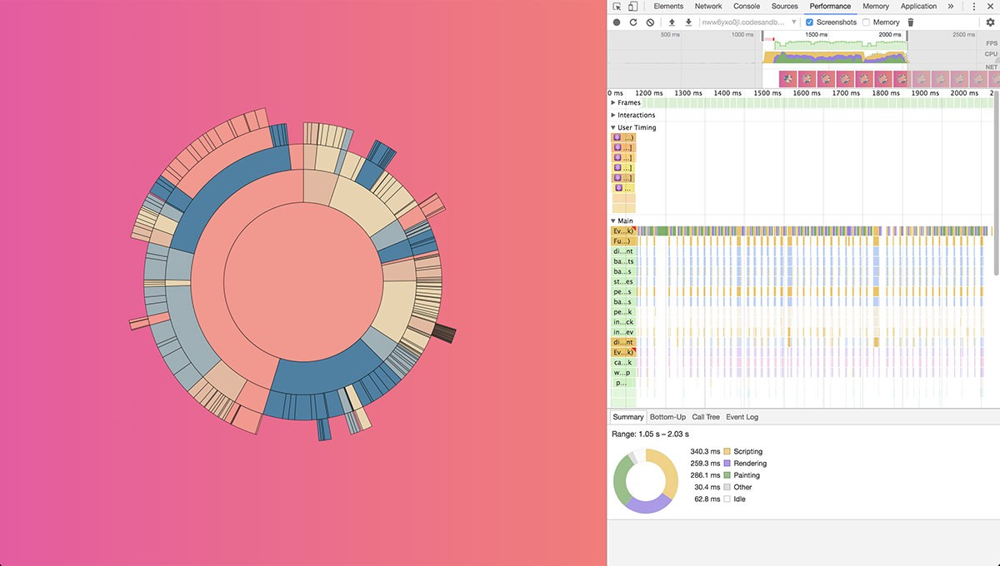

<span class="badge-patreon"><a href="https://www.patreon.com/0xca0a" title="Donate to this project using Patreon"></a></span> [](#backers) [](#sponsors) [](https://travis-ci.org/drcmda/react-spring) [](https://badge.fury.io/js/react-spring)  [](https://spectrum.chat/react-spring)

    npm install react-spring

# Table of Contents

- [What is it?](#what-is-it)
- [Why do we need yet another?](#why-do-we-need-yet-another)
- [What others say](#what-others-say)
- [Used by](#used-by)
- [API reference and examples](#api-reference-and-examples)
- [Basic overview](#basic-overview)
- [Interpolation](#interpolation)
- [Render props](#render-props)
- [Native rendering](#native-rendering)
- [React-native and other targets](#react-native-and-other-targets)
- [Funding](#funding)

# What is it?

<p align="middle">
  <a href="https://codesandbox.io/embed/oln44nx8xq"></a>
  <a href="https://codesandbox.io/embed/j150ykxrv"></a>
  <a href="https://codesandbox.io/embed/vvmv6x01l5"></a>
</p>
<p align="middle">
  <a href="https://codesandbox.io/embed/9jrjqvq954"></a>
  <a href="https://codesandbox.io/embed/nww6yxo0jl"></a>
  <a href="https://codesandbox.io/embed/j3x61vjz5v"></a>
</p>
<p align="middle">
  <a href="https://codesandbox.io/embed/jzn14k0ppy"></a>
  <a href="https://codesandbox.io/embed/yj52v5689"></a>
  <a href="https://codesandbox.io/embed/lwpkp46om"></a>
</p>
<p align="middle">
  <a href="https://codesandbox.io/embed/0oonqxnpjl"></a>
  <a href="https://codesandbox.io/embed/548lqnmk6l"></a>
  <a href="https://codesandbox.io/embed/zl35mrkqmm"></a>
</p>
<p align="middle">
  <a href="https://codesandbox.io/embed/l9zqz0m18z"></a>
  <a href="https://codesandbox.io/embed/py3p5p11m7"></a>
  <a href="https://codesandbox.io/embed/q9lozyymr9"></a>
</p>

A set of spring-physics based primitives (as in building blocks) that should cover most of your UI related animation needs once plain CSS can't cope any longer. Forget easings, durations, timeouts and so on as you fluidly move data from one state to another. This isn't meant to solve each and every problem but rather to give you tools flexible enough to confidently cast ideas into moving interfaces.

# Why do we need yet another?

react-spring is a cooked down fork of Christopher Chedeau's [animated](https://github.com/animatedjs/animated) (which is used in react-native by default). It is trying to bridge it with Cheng Lou's [react-motion](https://github.com/chenglou/react-motion). Although both are similarily spring-physics based they are still polar opposites.

|                | Declarative | Primitives | Interpolations | Performance |
| -------------- | ----------- | ---------- | -------------- | ----------- |
| React-motion   | ✅          | ✅         | ❌             | ❌          |
| Animated       | ❌          | ❌         | ✅             | ✅          |
| React-spring   | ✅          | ✅         | ✅             | ✅          |

react-spring builds upon animated's foundation, making it leaner and more flexible. It inherits react-motions declarative api and goes to great lengths to simplify it. It has lots of useful primitives, can interpolate mostly everything and last but not least, can animate by committing directly to the dom instead of re-rendering a component frame-by-frame.

For a more detailed explanation read [Why React needed yet another animation library](https://medium.com/@drcmda/why-react-needed-yet-another-animation-library-introducing-react-spring-8212e424c5ce).

# What others say

<p align="middle">
  
</p>

# Used by

<p align="middle">
  <a href="https://nextjs.org/"></a>
  <a href="https://codesandbox.io/"></a>
  <a href="https://aragon.org/"></a>
</p>

And [many others](https://github.com/drcmda/react-spring/network/dependents) ...

# API Reference and examples

You'll find a full docs, live playgrounds, prop descriptions and so forth here:

<h3><a href="http://react-spring.surge.sh/">http://react-spring.surge.sh/</a></h3>

# Basic overview

## Springs ([Demo](https://codesandbox.io/embed/oln44nx8xq))


A `Spring` will move data from one state to another. It remembers the current state, value changes are always fluid.

```jsx
import { Spring } from 'react-spring'

<Spring from={{ opacity: 0 }} to={{ opacity: 1 }}>
  {styles => <div style={styles}>i will fade in</div>}
</Spring>
```

## Mount/unmount Transitions ([Demo](https://codesandbox.io/embed/j150ykxrv))


`Transition` watches elements as they mount and unmount, it helps you to animate these changes.

```jsx
import { Transition } from 'react-spring'

<Transition
  keys={items.map(item => item.key)}
  from={{ opacity: 0, height: 0 }}
  enter={{ opacity: 1, height: 20 }}
  leave={{ opacity: 0, height: 0, pointerEvents: 'none' }}>
  {items.map(item => styles => <li style={styles}>{item.text}</li>)}
</Transition>
```

## 2-state and 1-state Reveals ([Demo](https://codesandbox.io/embed/yj52v5689))


Given a single child instead of a list you can toggle between two components.

```jsx
import { Transition } from 'react-spring'

<Transition from={{ opacity: 0 }} enter={{ opacity: 1 }} leave={{ opacity: 0 }}>
  {toggle
    ? styles => <div style={styles}>Component A</div>
    : styles => <div style={styles}>Component B</div>
  }
</Transition>
```

If you need to toggle a single child, that is also possible.

```jsx
import { Transition } from 'react-spring'

<Transition from={{ opacity: 0 }} enter={{ opacity: 1 }} leave={{ opacity: 0 }}>
  {visible && (styles => <div style={styles}>Single Component</div>)}
</Transition>
```

## Trails and staggered animations ([Demo](https://codesandbox.io/embed/vvmv6x01l5))


`Trail` animates the first child of a list of elements, the rest follow the spring of their previous sibling.

```jsx
import { Trail } from 'react-spring'

<Trail from={{ opacity: 0 }} to={{ opacity: 1 }} keys={items.map(item => item.key)}>
  {items.map(item => styles => <div style={styles}>{item.text}</div>)}
</Trail>
```

## Keyframes ([Demo](https://codesandbox.io/embed/zl35mrkqmm))


`Keyframes` allow you to chain, compose and orchestrate animations by creating predefined slots. The resulting primitive behaves like the primitive it stems from, it can receive all generic properties like `native` or `from`, etc. You make it animate by passing the `state` props, which receives the named slot.

```jsx
import { Keyframes, config } from 'react-spring'

// You can create keyframes for springs, trails and transitions
const Container = Keyframes.Spring({
  // Single props
  show: { to: { opacity: 1 } },
  // Chained animations (arrays)
  showAndHide: [ { to: { opacity: 1 } }, { to: { opacity: 0 } }],
  // Functions with side-effects
  wiggle: async call => {
    await call({ to: { x: 100 }, config: config.wobbly })
    await delay(1000)
    await call({ to: { x: 0 }, config: config.gentle })
  }
})

<Container state="show">
  {styles => <div style={styles}>Hello</div>}
</Container>
```

## Parallax and page transitions ([Demo](https://codesandbox.io/embed/548lqnmk6l))


`Parallax` allows you to declaratively create page/scroll-based animations.

```jsx
import { Parallax, ParallaxLayer } from 'react-spring'

<Parallax pages={2}>
  <ParallaxLayer offset={0} speed={0.2}>
    first Page
  </ParallaxLayer>
  <ParallaxLayer offset={1} speed={0.5}>
    second Page
  </ParallaxLayer>
</Parallax>
```

## Time/duration-based implementations and addons ([Demo](https://codesandbox.io/embed/q9lozyymr9))


You'll find varying implementations under [/dist/addons](https://github.com/drcmda/react-spring/tree/master/src/addons). For now there's a time-based animation as well common [easings](https://github.com/drcmda/react-spring/blob/master/src/addons/Easing.js), and IOS'es harmonic oscillator spring. All primitives understand the `impl` property which you can use to switch implementations.

```jsx
import { TimingAnimation, Easing } from 'react-spring/dist/addons'

<Spring impl={TimingAnimation} config={{ duration: 1000, easing: Easing.linear }} >
```

# Interpolation

We don't handle just numbers, you can interpolate almost everything:

- colors (names, rgb, rgba, hsl, hsla)
- absolute lenghts (cm, mm, in, px, pt, pc)
- relative lengths (em, ex, ch, rem, vw, vh, vmin, vmax, %)
- angles (deg, rad, grad, turn)
- flex and grid units (fr, etc)
- all HTML attributes
- SVG paths (as long as the number of points matches, otherwise use [custom interpolation](https://codesandbox.io/embed/lwpkp46om))
- arrays
- string patterns (`transform`, `border`, `boxShadow`, etc)
- `auto` is valid
- non-animatable string values (`visibility`, `pointerEvents`, etc)
- `scrollTop`/`scrollLeft` (native only, since these aren't actual dom properties)

```jsx
<Spring
  to={{
    width: 'auto',
    padding: 20,
    width: '80%',
    background: 'linear-gradient(to right, #009fff, #ec2f4b)',
    transform: 'perspective(600px) translate3d(0px,0,0) scale(1) rotateX(0deg)',
    boxShadow: '0px 10px 20px 0px rgba(0,0,0,0.4)',
    borderBottom: '10px solid #2D3747',
    shape: 'M20,20 L20,380 L380,380 L380,20 L20,20 Z',
    textShadow: '0px 5px 15px rgba(255,255,255,0.5)' }}>
```

# Native rendering

|                                                                                                                                                                                         |                                                                                                                                                                                          |
| ------------------------------------------------------------------------------------------------------------------------------------------------------------------------------------------------------------------------- | ----------------------------------------------------------------------------------------------------------------------------------------------------------------------------------------------------------------------- |
| <sub>Most libs animate by having React recalculate the component-tree on every frame. Here it attempts to animate a component consisting of ~300 sub-components, plowing through the frame budget and causing jank.</sub> | <sub>React-spring with the `native` property renders the component _only once_, from then on the animation will be applied directly to the dom in a requestAnimationFrame-loop, similar to how gsap and d3 do it.</sub> |

```jsx
import { Spring, animated } from 'react-spring'

<Spring native from={{ opacity: 0 }} to={{ opacity: 1 }}>
  {styles => <animated.div style={styles}>i will fade in</animated.div>}
</Spring>
```

Native rendering comes with a few caveats you should know about before using it, more about that [here](https://github.com/drcmda/react-spring/blob/master/API-OVERVIEW.md#native-rendering-and-interpolation-demo). Try going native in all situations where you can, the benefits are worth it!

# Funding

If you like this project, consider helping out, all contributions are welcome as well as donations to [opencollective](https://opencollective.com/react-spring) or [Patreon](https://www.patreon.com/0xca0a). You can make one off donations in crypto to 36fuguTPxGCNnYZSRdgdh6Ea94brCAjMbH (BTC).

## Contributors

This project exists thanks to all the people who contribute.
<a href="graphs/contributors"></a>

## Backers

Thank you to all our backers! 🙏

<a href="https://opencollective.com/react-spring#backers" target="_blank"></a>

## Gold sponsors

<a href="https://aragon.org/"></a>

## Sponsors

Support this project by [becoming a sponsor](https://opencollective.com/react-spring#sponsor). Your logo will show up here with a link to your website.

<a href="https://opencollective.com/react-spring/sponsor/0/website" target="_blank"></a>
<a href="https://opencollective.com/react-spring/sponsor/1/website" target="_blank"></a>
