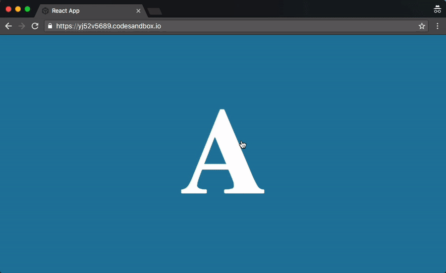
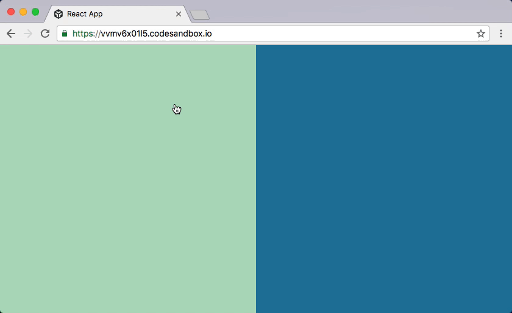

[](https://travis-ci.org/drcmda/react-spring) [](https://badge.fury.io/js/react-spring)

    npm install react-spring

# Why 🤔

React-spring is a cooked down fork of [Facebooks animated](https://github.com/animatedjs/animated). It is trying to bridge it with Chenglou's [React-motion](https://github.com/chenglou/react-motion) because both have their pros and cons and could definitively benefit from one another:

|                | Declarative | Primitives | Interpolations     | Performance | 
|----------------|-------------|----------------|----------------|-------------|
| React-motion   | ✅ | ✅ | ❌ | ❌
| Animated       | ❌ | ❌ | ✅ | ✅
| React-spring   | ✅ | ✅ | ✅ | ✅

React-spring inherits react-motions api (and simplifies it), has lots of primitives (springs, trails, transitions, reveals, parallax), can interpolate mostly everything (colors, gradients, percentages, degrees, svg-paths, arrays, etc.) and last but not least, can animate by committing directly to the dom instead of re-rendering a component frame-by-frame.

# Overview 🔭

<p align="middle">
  
   
</p>
<p align="middle">
  
  
</p>
<p align="middle">
   
   
</p>

```jsx
import { Spring, Transition, Trail, Parallax } from 'react-spring'
```

#### Springs ([Demo](https://codesandbox.io/embed/oln44nx8xq))

A `Spring` will move data from one state to another. It remembers the current state, value changes are always fluid.

```jsx
<Spring from={{ opacity: 0 }} to={{ opacity: 1 }}>
    {styles => <div style={styles}>i will fade in</div>}
</Spring>
```

#### Mount/unmount Transitions ([Demo](https://codesandbox.io/embed/j150ykxrv))

`Transition` watches elements as they mount and unmount, it helps you to animate these changes.

```jsx
<Transition
    keys={items.map(item => item.key)}
    from={{ opacity: 0, height: 0 }}
    enter={{ opacity: 1, height: 20 }}
    leave={{ opacity: 0, height: 0 }}>
    {items.map(item => styles => <li style={styles}>{item.text}</li>)}
</Transition>
```

#### 2-state Reveals ([Demo](https://codesandbox.io/embed/yj52v5689))

Given a single child instead of a list you can reveal components with it.

```jsx
<Transition
    from={{ opacity: 0 }} 
    enter={{ opacity: 1 }} 
    leave={{ opacity: 0 }}>
    {toggle ? ComponentA : ComponentB}
</Transition>
```

#### Trails and staggered animations ([Demo](https://codesandbox.io/embed/vvmv6x01l5))

`Trail` animates the first child of a list of elements, the rest follow the spring of their previous sibling.

```jsx
<Trail from={{ opacity: 0 }} to={{ opacity: 1 }} keys={items.map(item => item.key)}>
    {items.map(item => styles => <div style={styles}>{item.text}</div>)}
</Trail>
```

#### Parallax and page transitions ([Demo](https://codesandbox.io/embed/548lqnmk6l))

`Parallax` allows you to declaratively create page/scroll-based animations.

```jsx
<Parallax pages={2}>
    <Parallax.Layer offset={0} speed={0.2}>first Page</Parallax.Layer>
    <Parallax.Layer offset={1} speed={0.5}>second Page</Parallax.Layer>
</Parallax>
```

#### Additional demos: [Vertical scroll](https://codesandbox.io/embed/0oonqxnpjl) | [Gestures](https://codesandbox.io/embed/jzn14k0ppy) | [Routing](https://codesandbox.io/embed/xo0lrqw2nz) | [Graphs](https://codesandbox.io/embed/j3x61vjz5v) | [TodoMVC](https://codesandbox.io/embed/2pk8l7n7kn) | [Drag/n/drop](https://codesandbox.io/embed/l9zqz0m18z)

# API overview 📖

For a raw documentation of all possible properties look [here](https://github.com/drcmda/react-spring/blob/master/API.md).

### Springs and interpolation

You can interpolate almost everything, from numbers, colors, svg-paths, percentages, arrays to string patterns:

```jsx
<spring to={{
    scale: toggle ? 1 : 2,
    start: toggle ? '#abc' : 'rgb(10,20,30)',
    end: toggle ? 'seagreen' : 'rgba(0,0,0,0.5)',
    stop: toggle ? '0%' : '50%',
    rotate: toggle ? '0deg' : '45deg',
    path: toggle ? 'M20,380 L380,380 L380,380 Z' : 'M20,20 L20,380 L380,380 Z',
    vector: toggle ? [1,2,50,100] : [20,30,1,-100],
}}>
```

### Render props

Don't like the way render props wrap your code?

```jsx
const Header = ({ children, bold, ...styles }) => (
    <h1 style={styles}>
        {bold ? <b>{children}</b> : children}
    </h1>
)


<Spring render={Header} to={{ color: 'fuchsia' }} bold>
    hello there
</Spring>

```

Et voilà! `Header` animates on prop changes! Props that `Spring` doesn't recognize will be spread over the receiving component, in this example `bold`, but it also includes `children` if you use `render` to refer to the render-child.

### Native rendering ([Demo](https://codesandbox.io/embed/882njxpz29))

By default we'll render the receiving component every frame as it gives you more freedom to animate. In situations where that becomes expensive add the `native` flag and animations will now be applied directly to the dom. The flag is available for all primitives (Spring, Transition & Trail, Parallax is native by design).

Just be aware of the following conditions:

1.  It only animates element styles and attributes, the values you receive *are opaque objects, not regular values*
2.  Receiving elements must be `animated.[elementName]`, for instance `div` becomes `animated.div`
3.  If you need to interpolate styles use the `template` string literal

```jsx
import { Spring, animated, template } from 'react-spring'

<Spring native to={{ path, rotate, scale }}>
    {({ rotate, scale, path }) => (
        <animated.svg style={{ transform: template`rotate(${rotate}) scale(${scale})` }}>
            <g><animated.path d={path} /></g>
        </animated.svg>
    )}
</Spring>
```

### Transitions

Animates children as they mount and unmount. `from` denotes base styles, `enter` styles are applied when objects appear, `leave` styles are applied when objects disappear. Keys and children have to match in their order! The keys are the same that you would provide in any other looping situation.

```jsx
import { Transition } from 'react-spring'

<ul>
    <Transition
        keys={items.map(item => item.key)}
        from={{ opacity: 0, height: 0 }}
        enter={{ opacity: 1, height: 20 }}
        leave={{ opacity: 0, height: 0 }}>
        {items.map(item => styles => <li style={styles}>{item.text}</li>)}
    </Transition>
</ul>
```

You can use this prototype for two-state reveals, simply render a single child that you can switch out for another. You don't have to pass keys for this one.

```jsx
<Transition
    from={{ opacity: 0 }} 
    enter={{ opacity: 1 }} 
    leave={{ opacity: 0 }}>
    {toggle ? ComponentA : ComponentB}
</Transition>
```

### Trails/Staggered transitions

`Trail` animates the first child of the list you pass, the others will follow in a trailing motion. The api is similar to `Transition` though it will assume your list is fixed.

```jsx
import { Trail } from 'react-spring'

<Trail from={{ opacity: 0 }} to={{ opacity: 1 }} keys={items.map(item => item.key)}>
    {items.map(item => styles => <div style={styles}>{item.text}</div>)}
</Trail>
```

### Parallax and page transitions

`Parallax` creates a scroll container. Throw in any amount of layers and it will take care of moving them in accordance to their offsets and speeds.

`Parallax.pages` determines the total space of the inner content where each page takes 100% of the visible container. `Layer.offset` determines where the layer will be at when scrolled to (0=start, 1=1st page, ...). `Layer.speed` shifts the layer in accordance to its offset, values can be positive or negative.

```jsx
import { Parallax } from 'react-spring'

<Parallax pages={3} scrolling={false} horizontal ref={ref => this.parallax = ref}>
    <Parallax.Layer offset={0} speed={0.5}>
        <span onClick={() => this.parallax.scrollTo(1)}>
            Layers can contain anything
        </span>
    </Parallax.Layer>
</Parallax>
```

---

[API](https://github.com/drcmda/react-spring/blob/master/API.md) | [Changelog](https://github.com/drcmda/react-spring/blob/master/CHANGELOG.md)
