

  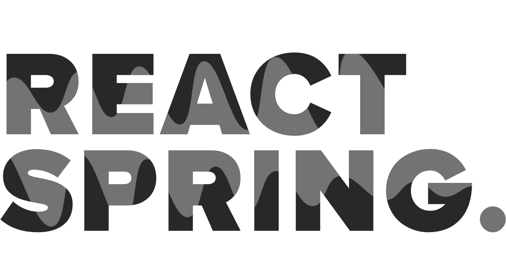

  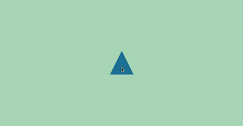
  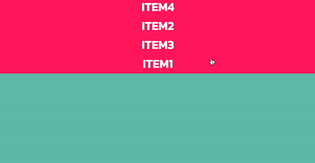
  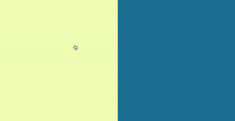

  
  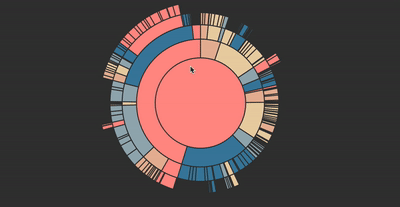
  

  
  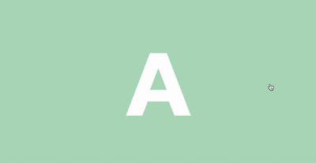
  

  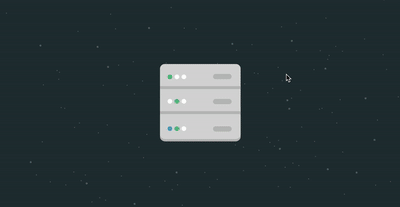
  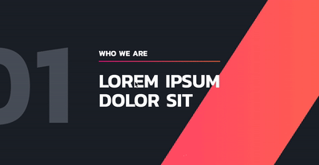
  

  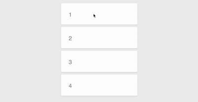
  
  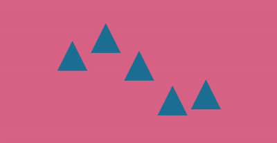

 

      

    npm install react-spring

React-spring is a spring physics based animation library for React.

For a more detailed explanation read [Why React needed yet another animation library](https://medium.com/@drcmda/why-react-needed-yet-another-animation-library-introducing-react-spring-8212e424c5ce).

# Documentation and Examples

Full documentation and examples here: **[react-spring.surge.sh](https://react-spring.surge.sh/)**

---

# What others say

  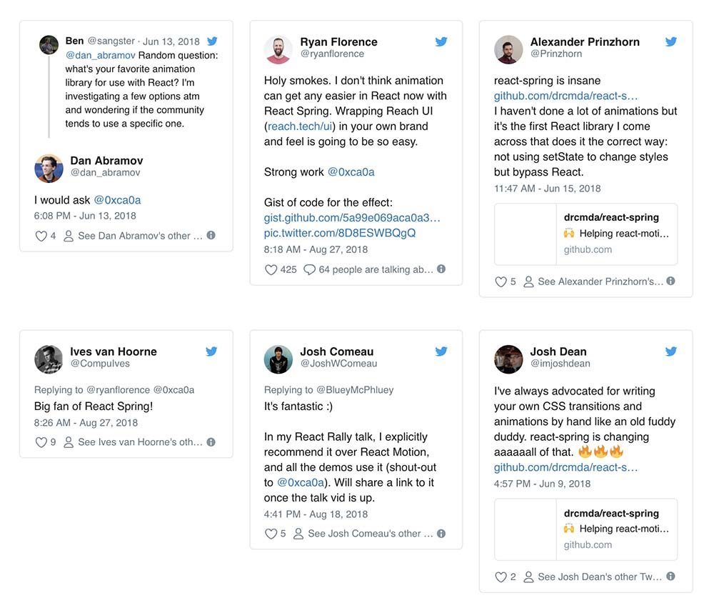

# Used by

  <a href="https://nextjs.org/">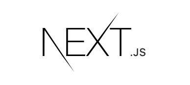</a>
  
  <a href="https://aragon.org/">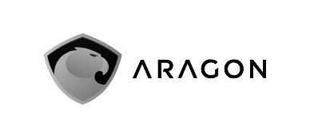</a>

And [many others](https://github.com/drcmda/react-spring/network/dependents) ...

# Funding

If you like this project, consider helping out, ... all contributions are welcome as well as donations to [Opencollective](https://opencollective.com/react-spring) or [Patreon](https://www.patreon.com/0xca0a). You can make one off donations in crypto to 36fuguTPxGCNnYZSRdgdh6Ea94brCAjMbH (BTC).

## Contributors

This project exists thanks to all the people who contribute.

## Backers

Thank you to all our backers! 🙏

## Gold sponsors

## Sponsors

Support this project by [becoming a sponsor](https://opencollective.com/react-spring#sponsor). Your logo will show up here with a link to your website.

